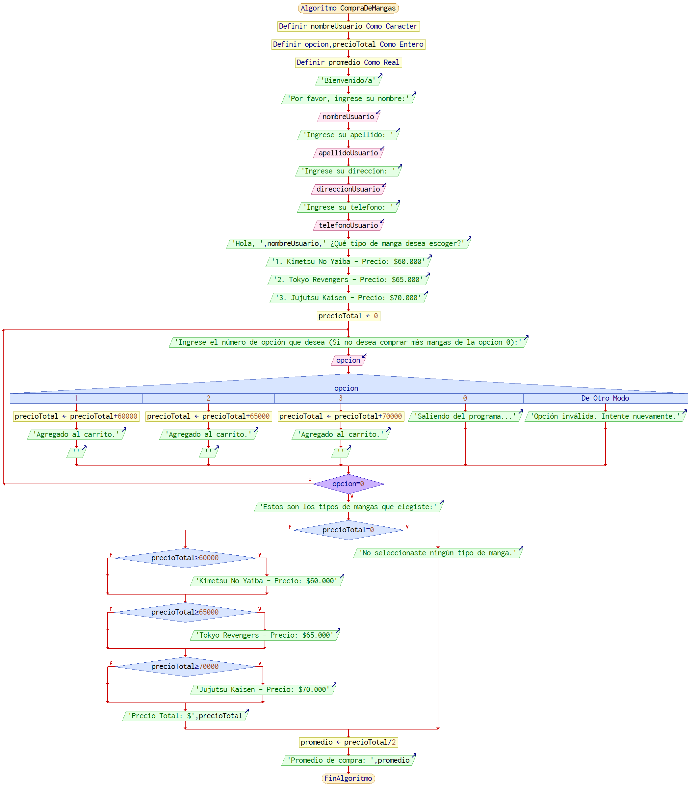

# Ejercicio Base

En su labor como programador de software ha sido elegido para el desarrollo de una aplicación que 
necesita una administradora de ventas, que necesita calcular el promedio de las ventas de cada usuario que entre a su página a comprar alguno de sus tres mangas más populares. Esta empresa 
cálcula sus ventas según la cantidad de mangas que el usuario requiera y el promedio de compra segun el precio total de la compra del usuario. Como información básica se le sugiere al usuario su nombre, apellido, dirección y telefono para saber quien esta haciendo la compra de los mangas y quede su registro de compra y promedio de esta.

 
Aclaraciones: 
 
• Nuestra empresa solo se requiere para vender 3 mangas especificos para asi calcular el total de la compra del usuario y el promedio de la venta.

• No se realiza validación, ni se verifica calidad en los datos ingresados.

• No se puede hacer devolución ni cancelación del pedido cuando ya lo estaba pidiendo o ya lo pidio.

 
 
 

# Historia de usuario
 

 
 
 

# Aproximación Caso de Uso
 

 

DESCRIPCIÓN CASO DE USO 

Nombres: Calcular total y promedio de venta

Actores: Administradora

Propósito:
El propósito de este caso de uso es permitir a la administradora calcular el promedio de compra de mangas de un usuario, tomando en cuenta los mangas seleccionados y sus respectivos precios.

Curso normal de eventos:

1. El sistema da la bienvenida al usuario y solicita que ingrese su nombre, apellido, dirección y teléfono.

2. El usuario mira las opciones de mangas disponibles para comprar, junto con sus respectivos precios.

3. El usuario selecciona una opción ingresando el número correspondiente. Si no desea comprar más mangas, selecciona la opción 0.

4. La opción seleccionada por el usuario realiza lo siguiente:

Caso 1: Si la opción seleccionada es 1 (Kimetsu No Yaiba), se agrega el precio del manga al precio total de la compra y se muestra un mensaje indicando que el manga ha sido agregado al carrito.

Caso 2: Si la opción seleccionada es 2 (Tokyo Revengers), se agrega el precio del manga al precio total de la compra y se muestra un mensaje indicando que el manga ha sido agregado al carrito.

Caso 3: Si la opción seleccionada es 3 (Jujutsu Kaisen), se agrega el precio del manga al precio total de la compra y se muestra un mensaje indicando que el manga ha sido agregado al carrito.

Caso 0: Si la opción seleccionada es 0, se muestra un mensaje indicando que el usuario está saliendo del programa.

De otro modo: Si la opción seleccionada no es válida, se muestra un mensaje indicando que la opción es inválida y se solicita al usuario que intente nuevamente.

5. Una vez que el usuario ha seleccionado todas las opciones de manga que desea comprar, el sistema muestra los tipos de mangas seleccionados junto con el precio total de la compra.

6. Se muestra el promedio de las ventas.

 
 

# Diagrama de flujo
 

   
Entender el anterior diagrama no debe presentar mayores problemas. Sin embargo, es conveniente realizar las siguientes 
aclaraciones y comentarios: 

• Aunque se puede condensar el código incluyendo las instrucciones del segundo “Para” dentro del primero, de manera 
intencional se ha dejado así intencionalmente para delimitar funcionalmente cada bloque de código. 

• En el algoritmo se captura información, como el nombre, el apellido, la dirección y el telefono, que no se utiliza; sin embargo, 
esta información se mantiene porque posteriormente puede ser útil para ampliar la funcionalidad de la aplicación. 
Inicialmente el algoritmo no contempla validaciones como impedir el doble ingreso de un mismo número de 
identificación.

 
 

# Aproximación Seudocódigo
 

    Algoritmo CompraDeMangas

    Definir nombreUsuario Como Caracter
    Definir opcion, precioTotal Como Entero
	Definir promedio Como Real
    
    Escribir "Bienvenido/a"
    Escribir "Por favor, ingrese su nombre:"
    Leer nombreUsuario
	Escribir "Ingrese su apellido: "
	Leer apellidoUsuario
	Escribir "Ingrese su direccion: "
	Leer direccionUsuario
	Escribir "Ingrese su telefono: "
	Leer telefonoUsuario
    
    Escribir "Hola, ", nombreUsuario, " ¿Qué tipo de manga desea escoger?"
    Escribir "1. Kimetsu No Yaiba - Precio: $60.000"
    Escribir "2. Tokyo Revengers - Precio: $65.000"
    Escribir "3. Jujutsu Kaisen - Precio: $70.000"
    
    precioTotal <- 0
    
    Repetir
        Escribir "Ingrese el número de opción que desea (Si no desea comprar más mangas de la opcion 0):"
        Leer opcion
        
        Segun opcion Hacer
            Caso 1:
                precioTotal <- precioTotal + 60000
                Escribir "Agregado al carrito."
                Escribir ""
            Caso 2:
                precioTotal <- precioTotal + 65000
                Escribir "Agregado al carrito."
                Escribir ""
            Caso 3:
                precioTotal <- precioTotal + 70000
                Escribir "Agregado al carrito."
                Escribir ""
            Caso 0:
                Escribir "Saliendo del programa..."
            De Otro Modo:
                Escribir "Opción inválida. Intente nuevamente."
        FinSegun
    Hasta Que opcion = 0
    
    Escribir "Estos son los tipos de mangas que elegiste:"
    Si precioTotal = 0 Entonces
        Escribir "No seleccionaste ningún tipo de manga."
    Sino
        Si precioTotal >= 60000 Entonces
            Escribir "Kimetsu No Yaiba - Precio: $60.000"
        FinSi
        Si precioTotal >= 65000 Entonces
            Escribir "Tokyo Revengers - Precio: $65.000"
        FinSi
        Si precioTotal >= 70000 Entonces
            Escribir "Jujutsu Kaisen - Precio: $70.000"
        FinSi
        Escribir "Precio Total: $", precioTotal
    FinSi
	promedio = precioTotal / 2 
	Escribir "Promedio de compra: ", promedio
    FinAlgoritmo